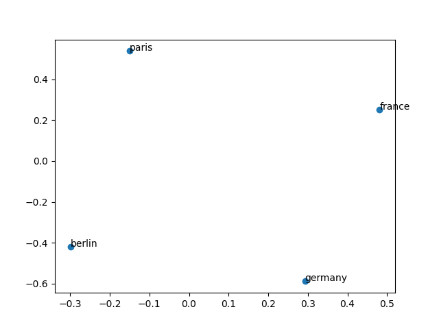

# Poor Man's Transformers

Advanced Deep Learning from the ground-up.

The idea of this repository is to implement the necessary framework and layers of a transformer using just `numpy` for
learning purposes. The end goal is to train a Transformer model on [QQP](https://www.kaggle.com/c/quora-question-pairs)
or a model that performs Named Entity Recognition (NER) decently. I was inspired by
[ML-From-Scratch](https://github.com/eriklindernoren/ML-From-Scratch),
the [Advanced Machine Learning Specialization](https://www.coursera.org/specializations/aml), and
the [Natural Language Processing Specialization](https://www.coursera.org/specializations/natural-language-processing).

Self-imposed rules for developing this toy framework:

- Use only the python standard library and `numpy` as a (tensor algebra) dependency. I relaxed this rule a bit to
  include some other useful features such as a progress bar for the training loop (using `tqdm`) and visualizations (
  with
  `matplotlib`).
- Readability is more important than efficiency here. Code is not optimal but should be clear.
- No scooping at PyTorch, TensorFlow, or [tinygrad](https://github.com/tinygrad/tinygrad) implementations.

## :notebook: Development log

I'm keeping track of my progress in this section, so it can be used for future reference when learning Deep Learning
from the very basics.

### Index

* [First steps: basic layers and training framework for an MLP](#bookmark-first-steps-basic-layers-and-training-framework-for-an-mlp)
* Convolutional Neural Networks (TODO)
* [Word Embeddings](#construction-word-embeddings)
* [Handling non-sequential architectures](#construction-handling-non-sequential-architectures)

---

### :bookmark: First steps: basic layers and training framework for an MLP

First things first, I need to implement the basic structure of the framework and be able to train a Multilayer
Perceptron (MLP) with it. I base my work
on [ML-From-Scratch Deep Learning implementation](https://github.com/eriklindernoren/ML-From-Scratch#deep-learning)
and an assignment from the [Introduction to Deep Learning](https://www.coursera.org/learn/intro-to-deep-learning)
course.

Even though this was supposed to be an easy step, I ended up spending a lot of time on it trying to come up with the
simplest OOP architecture possible. New layers have to be easy to code, and I also want to experiment with different
optimizers (SGD, Adam, RMSProp), learning rate schedules, activation functions (ReLU, tanh, sigmoid, Softmax,
LogSoftmax), custom loss functions (sum binary cross-entropy and categorical cross-entropy as used for training BERT)
and easily handle input & output flow (serial, parallel, concatenations, skip-connections). At the same time, I wouldn't
like to waste time building a flexible and feature-rich framework since we already have PyTorch, TensorFlow with Keras,
[JAX](https://github.com/google/jax), and [Google Trax](https://github.com/google/trax) for that.

To keep this toy "framework" as simple as possible, I want to minimize the number of base classes. I ended up with:
`Layer`, `Parameter` (used in a `Layer` with an associated `Optimizer`), `Trainer`, and `Loss`. `Activation` functions
are a subclass of a `Layer` object. This simplification comes with its costs, of course, in terms of RAM usage: more
"intermediate" tensors will be stored in memory. When training a `Dense` layer with a `ReLU` activation, for example,
both the linear combination and the rectified (`max(X, 0)`) tensors will be stored in memory. I do not intend to run
this framework on a GPU, so RAM usage is not a big concern right now. Each layer will implement its backpropagation
step, the derivatives with respect to each parameter (Jacobian matrix) have to be computed because I don't want to
implement a tool such as [Autograd](https://github.com/hips/autograd) to do this automatically.

Here's the list of objects I implemented:

#### :pushpin: Layer and Activation

A layer performs two operations: forward propagation and backward propagation. For doing the forward pass, it receives
an input batch `X` and uses its `Parameter`s to compute the output batch. And in the case of the backward pass, it
receives the accumulated gradient `grad` (which represents the derivatives `d_loss / d_layer` for each element in the
batch) to compute and propagate to the previous layer: `d_loss / d_input = d_loss / d_layer · d_layer / d_input`. It
also receives the input batch `X` used in the forward step to compute the gradients with respect to the
parameters `d_loss / d_parameter = d_loss / d_layer · d_layer / d_parameter`. Next, it calls the `update` method on
all `Parameter`s which use an `Optimizer` instance to update their weights. Finally, the accumulated
gradient `d_loss / d_input` is returned to proceed with the network's backward propagation.

When instantiated, an `input_shape` and `output_shape` could be set, or else they will be set by the `Trainer` during
the model's initialization step. The initial weights of each `Parameter` also need to be defined during this step.

An `Activation` is a special type of `Layer` whose `input_shape` and `output_shape` are the same.

:heavy_check_mark: [Layer](poormanslayers/layers.py#L32-L77)
:heavy_check_mark: [Activation](poormanslayers/layers.py#L80-L90)
:white_check_mark: [Dense](poormanslayers/layers.py#L93-L131)
:white_check_mark: [ReLU](poormanslayers/layers.py#L134-L140)
:white_check_mark: [Softmax](poormanslayers/layers.py#L153-L171)
:white_check_mark: [LogSoftmax](poormanslayers/layers.py#L174-L191)
:white_check_mark: [Dropout](poormanslayers/layers.py#L194-L212)

#### :pushpin: Parameter and Optimizer

A `Parameter` is instantiated only by a `Layer`. Its weights can be accessed by calling the `Parameter` instance and are
updated during back-propagation using the `update` method. For `update` to be called, an `Optimizer` instance needs to
be set and its initial weights need to be defined during the `Layer`'s initialization.

Each `Parameter` instantiated in the framework will have a copy of an `Optimizer` instance with the properties defined
by the `Trainer` object. The `Optimizer` is in charge of updating the parameter's value and may store auxiliary
variables to do so, hence, each parameter has a unique copy of it. Again, it set by the `Trainer` during the model's
initialization.

:heavy_check_mark: [Parameter](poormanslayers/layers.py#L8-L29)
:heavy_check_mark: [Optimizer](poormanslayers/optimizers.py#L4-L11)
:white_check_mark: [Adam](poormanslayers/optimizers.py#L14-L43)

#### :pushpin: Loss and Metric

These classes are pretty straightforward: instances are called with the ground truth `y` and predictions `y_hat` (or
prediction's probabilities *logits*) and return the calculated metric. The `Loss` class also returns the gradient
`d_loss / d_yhat` to begin the backward propagation.

:heavy_check_mark: [Loss](poormanslayers/losses.py#L6-L27)
:heavy_check_mark: [Metric](poormanslayers/losses.py#L30-L41)
:white_check_mark: [CategoricalCrossEntropy](poormanslayers/losses.py#L44-L59)
:white_check_mark: [Accuracy](poormanslayers/losses.py#L76-L84)

#### :pushpin: Model, Trainer, and DataGeneratorWrapper

Instead of following Keras-style Sequential Model and the `model.compile()` method to define the optimizer, loss, and
metrics, a `Model` in this framework is just a list of `Layer` instances (I think this will help us handle complex flows
with stack operations). Hence, I defined the `Trainer` which receives a model, optimizer, loss, learning rate schedule,
early stopping, and metrics to run the supervised training with training and evaluation data generators. This approach
resembles the Trax framework more than Keras or PyTorch.

The `fit` method in `Trainer` is the key function of this class. It prepares the model by setting and validating the
`input_shape` and `output_shape` for every layer, and initializing the layer's weights. Training and evaluation data is
passed via a generator function that has to be written for every particular dataset and needs to be wrapped using the
`DataGeneratorWrapper` whose only purpose is to initialize the generator with all the arguments passed so that the data
could be "rewound" at the beginning of each epoch.

:heavy_check_mark: [Trainer](poormanslayers/train.py#L34)
:heavy_check_mark: [DataGeneratorWrapper](poormanslayers/train.py#L16-L31)

#### :warning: Challenges

The most difficult part of this first step was to do the backwards propagation. I needed to compute Jacobian matrices of
several vector functions. The following articles helped me clarify the math needed:

* [Jacobian, Chain rule and backpropagation](https://suzyahyah.github.io/calculus/machine%20learning/2018/04/04/Jacobian-and-Backpropagation.html)
* [The Softmax function and its derivative](https://eli.thegreenplace.net/2016/the-softmax-function-and-its-derivative/)

#### :gem: Sample code

:heavy_check_mark: [MLP for MNIST Digit recognition](./examples/mlp.py)

```shell
cd examples
./download_mnist.sh
python ./examples/mlp.py
```

---

### :construction: Word Embeddings

My next goal is to have an `Embedding` layer implemented and try it out by replicating
[word2vec](https://code.google.com/archive/p/word2vec/) models using both the Continuous Bag of Words (CBOW) and
Skip-Gram architectures. We should be able to generate word embeddings and compare their accuracy on the
Semantic-Syntactic Word Relationship test set mentioned in [word2vec's paper](https://arxiv.org/pdf/1301.3781.pdf).

With the framework in place and validated with the Multilayer Perceptron trained on MNIST, this part should have been a
matter of adding some subclasses and helper functions... but it wasn't. A very basic example with the CBOW model was
created by just adding the `Embedding` and `AxisMean` layers. There were two problems though: first, it's not an exact
replica of the model architecture since `Softmax` will propagate the gradients to all the words in the vocabulary
(Hierarchical Softmax is used in word2vec which is faster). Second, the lack of a `Lambda` layer which computes and
propagates the gradients of a user-defined forward function is difficult to code (not impossible, but we don't want
autograd here).

The skip-gram implementation, with negative sampling, is more faithful to its original implementation. But another
problem arises here: a `Model`, defined as a list of `Layer` objects, doesn't support multiple input branches (we need
both the target word and the context/negative word to be passed through the same `Embedding` layer and then merge them
with a dot product). The quick and dirty fix here is to pass both target and context through the `Embedding` layer and
create a `AxisDot` layer which computes the dot product along the axis whose shape is 2. A `Sigmoid` layer is used here,
which is a simpler version of the `Softmax` layer.

#### :pushpin: Embedding

The `Embedding` layer is equivalent to a `Dense` layer if we converted the word representations (numbers in the range
`[0, vocab_size)`) to their one-hot representation and performed a matrix-matrix dot product between the input and
weights. Here instead, the layer takes the word representation (integer between 0 and `vocab_size-1`) and use it to
index the weights' matrix. We avoid doing a matrix-matrix dot product which is more expensive.

:white_check_mark: [Embedding](poormanslayers/layers.py#L215-L247)

#### :pushpin: AxisMean

The CBOW model works by averaging the embeddings of a context window surrounding the target word. The dimension average
is usually done by a `Lambda` layer which takes a lambda function and use it as the forward propagation step. Frameworks
have tools like [autograd](https://github.com/HIPS/autograd) to compute a gradient (formally, *jacobian*) given the
forward function. For simplicity, I created the `AxisMean` layer instead of a `Lambda` layer which doesn't require the
aforementioned tool.

:white_check_mark: [AxisMean](poormanslayers/layers.py#L250-L270)

#### :construction: AxisDot

#### :construction: BinaryCrossEntropy

#### :pushpin: RMSProp

Implementing this optimizer is straightforward. Just need to keep a moving average of the element-wise squared gradient
and use its squared root when updating the weights.

:white_check_mark: [RMSProp](poormanslayers/optimizers.py#L46-L65)

#### :warning: Challenges

Implementing backpropagation for the `Embedding` layer was a bit tricky but not as hard as the Softmax and LogSoftmax
layers. The following resources guided me through this step:

* [What is the difference between an Embedding Layer and a Dense Layer?](https://stackoverflow.com/questions/47868265/what-is-the-difference-between-an-embedding-layer-and-a-dense-layer)
* [Back propagation in an embedding layer](https://medium.com/@ilyarudyak/back-propagation-in-an-embedding-layer-30382fa7f023)

As mentioned above, implementing the CBOW and Skip-gram architectures wasn't simple. I followed these articles:

* [Implementing Deep Learning Methods and Feature Engineering for Text Data: The Continuous Bag of Words (CBOW)](https://www.kdnuggets.com/2018/04/implementing-deep-learning-methods-feature-engineering-text-data-cbow.html)
* [word2vec](https://code.google.com/archive/p/word2vec/)
* [A word2vec Keras Tutorial (via web.archive.org)](https://web.archive.org/web/20210212061052/https://adventuresinmachinelearning.com/word2vec-keras-tutorial/)

Subsampling and negative sampling formulas used are explained in the following sources:

* [Word2Vec Tutorial Part 2 - Negative Sampling](https://mccormickml.com/2017/01/11/word2vec-tutorial-part-2-negative-sampling/)

Training word embeddings like those they released by word2vec is painfully slow and difficult. It's also very hard to
debug since we didn't follow the code they've released in C but copied the architecture they describe in their papers.
To validate that our network is working I created [this toy example](./examples/validate_word2vec.py) that trains a very
basic embedding of 2 dimensions with a vocabulary of words "Paris", "France", "Berlin", and "Germany". I got promising
results like the following:



The vector "Paris" -> "France" is almost the same as "Berlin" -> "Germany" indicating that this direction in the
embedding represents "is the capital of".

#### :construction: Sample code

:construction: [Continuous Bag of Words (CBOW) with Text8](./examples/cbow.py)

```shell
cd examples
./download_text8.sh
python ./cbow.py
```

:construction: [Skip-gram with Text8](./examples/skipgram.py)

```shell
cd examples
./download_text8.sh
python ./skipgram.py
```

---

### :construction: Handling non-sequential architectures

So far we created very simple model architectures that can be implemented as a sequence of layers. We could define the
multi-layer perceptron, convolutional neural networks, and, with some tricks (like `AxisDot`), the skip-gram model
in the previous section. But looking at more complex architectures, like the encoder-decoder transformer, we see that
tensors don't flow in a sequential manner. More generally, deep neural networks can be seen as directed acyclic
multi-graphs with several inputs and outputs, and residual operations. I tried to extend the original `Layer` class
to support networks but then realized that the framework is inflexible. I also began using PyTorch and found its
`nn.Module` component practical for defining any kind of architecture and connections (no need to
use [combinator layers](https://trax-ml.readthedocs.io/en/latest/trax.layers.html#module-trax.layers.combinators) for
example). Coding in a Deep Neural network on PyTorch is more natural. I therefore replicate this component from scratch,
with another caveat: since anyone can extend this module to implement any type of operation, automatic gradient
computation is a must.
